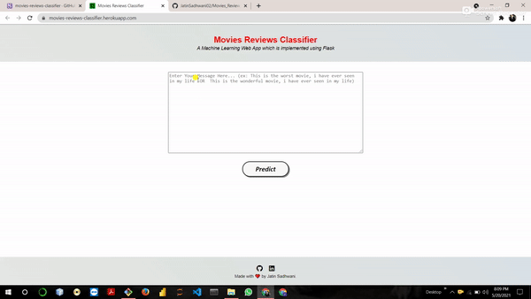

# Movies_Review_Classification_NLP

<h3>Dataset Link : https://www.kaggle.com/lakshmi25npathi/imdb-dataset-of-50k-movie-reviews</h3>
<br>

<br>

# 📌 Sentiment Analysis Using Naïve Bayes and Flask  

## 📖 Project Overview  
This project involves building an **end-to-end Sentiment Analysis application** using **Natural Language Processing (NLP)** techniques. The primary goal is to classify **movie reviews** as positive or negative using **TF-IDF vectorization** and a **Naïve Bayes classifier**.

## 🚀 Features  
- **Text Preprocessing:** Applied **stemming** and converted text into numerical features using **TF-IDF**.  
- **Model Training & Selection:**  
  - Used **Naïve Bayes classifier** to train the model.  
  - Tested and selected the best model based on performance.  
- **Model Deployment:**  
  - Saved the trained model as a `.pkl` file.  
  - Developed a **Flask-based web application** for real-time predictions.  
- **Web Interface:**  
  - `home.html` → User can input a review.  
  - `result.html` → Displays the predicted sentiment.  
- **REST API Implementation:**  
  - `POST /predict` → Takes text input and returns **sentiment prediction**.

## 🛠️ Installation & Setup  
### 1️⃣ Clone the Repository  
```bash
git clone https://github.com/your-username/your-repo-name.git
cd your-repo-name

REST API Integration:
The application exposes a POST endpoint (/predict) that takes text input and returns a sentiment prediction.
<br>
<h1> Working of Movies Reviews Classifier</h1>
<br>

<br>
<h1> Thank You !!!!!!!!!!!</h1>
